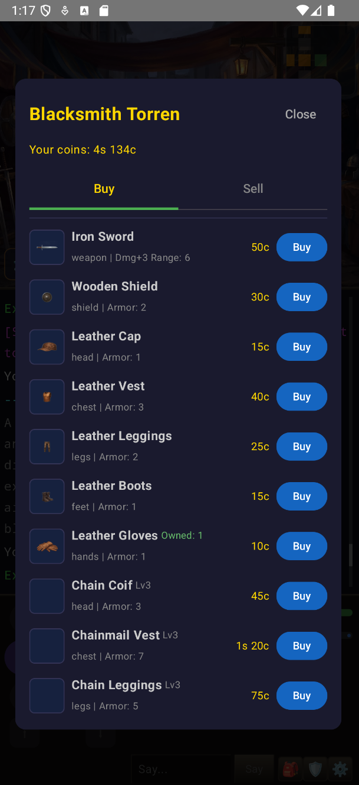

# NeoMud

A love letter to the MUDs of the '90s, built with modern tools and vibes. 100% vibe-coded with AI.

<p align="center">
  
  
</p>
<p align="center">
  
  
</p>

## What Is This?

NeoMud is a multiplayer dungeon game inspired by the text-based MUDs (Multi-User Dungeons) that consumed countless hours on dial-up connections in the 1990s. Games like MajorMUD, Legends of Kesmai, and the countless DikuMUD derivatives that ran on BBSes and early internet servers — where imagination filled in what pixels couldn't.

This project is a tribute to that era, but it doesn't try to be a museum piece. It takes the core of what made MUDs great — exploration, combat, character progression, and shared worlds — and wraps it in a modern mobile client with room art, sprite overlays, and a real-time WebSocket backbone. The text log is still there. The direction pad is still there. But now you can *see* the tavern you're drinking in.

## Why Vibe Code a MUD?

Because MUDs were the original MMOs, and they got a lot of things right that modern games lost along the way:

- **Worlds driven by data, not code.** Rooms, items, NPCs, loot tables, spells, and skills are all JSON. A game master can reshape the world without recompiling anything.
- **Emergent multiplayer.** You share a room with other players. You see them arrive and leave. You talk. You fight the same monsters. No instancing, no sharding — just a shared world.
- **Mechanical transparency.** You know your stats. You know your weapon damage. You can reason about the systems, and that reasoning is the game.

This project is vibe-coded — built iteratively with AI assistance, following intuition over architecture docs, letting the design emerge from play. It's not production software. It's a playground.

## Architecture

```
NeoMud/
├── shared/     Kotlin Multiplatform — models and protocol shared between client and server
├── server/     Ktor + Netty — WebSocket game server with SQLite persistence
├── client/     Jetpack Compose — Android client with sprite rendering
└── maker/      React + Express — web-based world editor and GM toolkit
```

**Server** runs a 1.5-second tick-based game loop. NPCs wander, patrol, and attack. Combat resolves each tick. Loot drops. Spells cool down. The world turns.

**Client** connects over WebSocket and renders the game as a layered scene: room background, NPC and item sprites, floating minimap, game log, and controls.

**Shared** module contains the protocol (sealed classes with `kotlinx.serialization`) and all data models. Client and server speak the same language at compile time.

**Maker** is a web-based world editor (React frontend, Express API) for building zones, rooms, NPCs, items, and more — with visual map editing and export to the server's `.nmd` bundle format.

## Current State

This is an early-stage hobby project. A lot of the systems exist but are lightly tested and need real playtesting to shake out balance issues and bugs. Here's an honest breakdown.

### What Works

**The World**
- 2 zones: Millhaven (safe town) and the Whispering Forest (hostile)
- 10 rooms total with AI-generated background art (WebP)
- JSON-driven room definitions with coordinates, exits, and background images
- BFS-based minimap showing nearby rooms with player/NPC presence
- Temple of the Dawn healing aura — passively restores HP each tick
- `.nmd` world bundles — self-contained ZIP archives with zone data, catalogs, and assets

**Characters**
- 6 races: Human, Dwarf, Elf, Halfling, Gnome, Half-Orc — each with stat modifiers and XP scaling
- 15 character classes: Warrior, Paladin, Witch Hunter, Cleric, Priest, Missionary, Mage, Warlock, Druid, Ranger, Thief, Ninja, Mystic, Bard, Gypsy
- 6-stat system: Strength, Agility, Intellect, Willpower, Health, Charm
- 60 CP stat allocation at character creation with escalating costs above class minimums
- Equipment slots: weapon, shield, head, chest, hands, legs, feet

**Combat & NPCs**
- Tick-based (1.5s) combat — weapon damage = Strength + bonus + random roll; armor reduces incoming
- Parry system — class-gated (Warrior, Paladin, Witch Hunter), STR-scaled chance to reduce incoming damage
- Dodge system — class-gated (Warrior, Thief, Ninja, Mystic, Ranger), AGI-scaled chance to avoid attacks entirely
- 6 NPCs across both zones (guards, vendors, trainers, hostile creatures)
- NPCs attack on sight if hostile; perception checks reveal hidden players
- Backstab from stealth for bonus damage
- Death respawns at the Temple of the Dawn with 10% XP penalty
- Continuous NPC spawn system per zone with configurable rates

**Items & Economy**
- 18 data-driven items: weapons, armor, consumables, crafting materials
- 2 loot tables (wolf and spider drops)
- Four-tier coin system: Copper, Silver, Gold, Platinum
- Vendor buy/sell with charm-based pricing and Haggle skill discounts
- Ground loot rendered as clickable sprites

**Progression**
- 30 level cap with XP from combat (scaled by level difference)
- CP gains per level for stat training
- Inventory icon grid with item sprites and tap-to-use consumables
- Paperdoll equipment screen with slot-based equip/unequip

**Audio**
- Per-zone background music with crossfade on zone transitions
- Sound effects for combat, movement, spells, and item interactions
- NPC interact sounds
- Configurable volume controls for BGM and SFX independently

**Client**
- 10-direction navigation pad (cardinal, diagonal, vertical)
- Minimap with clickable room navigation
- Game log, character sheet, spell bar
- Dark fantasy stone UI theme

### What Exists But Needs Work

**Spells & Skills**
- 20 spells across 5 magic schools (Mage, Priest, Druid, Kai, Bard) are defined in data
- 12 skills (Bash, Kick, Backstab, Parry, Dodge, Hide, Sneak, Meditate, Perception, Pick Lock, Track, Haggle) are defined
- Parry, Dodge, and Haggle are passive skills that scale linearly with their primary stat
- Spell bar UI exists with drag-to-assign slots
- The spell quick-cast menu is **not yet implemented** — spells currently fire from the spell bar only
- Most of the extended skill tree has **not been playtested** — expect balance issues

**Multiplayer**
- Real-time WebSocket sessions work for basic gameplay
- Room-based chat, player presence, one session per account
- Player state persists across sessions
- Server has a game state mutex and rate limiter
- **Needs significant stress testing** — concurrent player interactions, edge cases around combat with multiple players, reconnection handling are all lightly tested at best

**Maker (World Editor)**
- Full CRUD for all entity types: zones, rooms, NPCs, items, classes, races, skills, spells, loot tables
- Visual zone editor with drag-and-drop room placement and click-to-connect exits
- Room zone assignment — editable zone dropdown in room properties with cross-zone move support
- Default SFX editor — browse, preview, and regenerate system sound effects (dodge, parry, footsteps, etc.)
- Default player sprite editor — manage race/gender/class sprite combinations
- Import/export of `.nmd` bundles
- Default world auto-import with read-only projects and fork workflow
- **AI generation pipeline is early-stage** — image and audio generation endpoints exist, provider configuration works, but the pipeline needs more testing with real providers and error handling improvements
- Provider status now persists across page reloads
- Asset management with upload, undo history, and clear

## Tech Stack

| Layer | Technology |
|-------|-----------|
| Language | Kotlin 2.3 (JVM 21) |
| Server | Ktor 3.4 + Netty |
| Database | SQLite + Exposed ORM |
| Client | Jetpack Compose + Material 3 |
| Images | Coil 2.7 (WebP with transparency) |
| Audio | Android MediaPlayer + SoundPool |
| Protocol | kotlinx.serialization over WebSocket |
| Shared Code | Kotlin Multiplatform |
| Build | Gradle 8.11 with configuration cache |
| Maker | React 18 + Express + SQLite |

## Running It

### Prerequisites
- JDK 21 (e.g., Amazon Corretto)
- Android SDK with platform 36
- Android emulator or device (min SDK 26)
- Node.js 18+ (for the Maker)

### Server
```bash
export JAVA_HOME=/path/to/jdk21
./gradlew :server:run
```
The server starts on port 8080 with WebSocket at `/game` and health check at `/health`.

### Client
```bash
./gradlew :client:installDebug
```
Connect to `10.0.2.2:8080` from the emulator (or your server's IP from a device).

### Maker
```bash
cd maker
npm install
npm run dev
```
Opens the world editor at `http://localhost:5173`. On first run, it auto-imports the default world if `server/build/worlds/default-world.nmd` exists.

## Roadmap

### Near Term
- [ ] **Spell Quick-Cast Menu** — tap-to-cast from a radial or list menu, not just the spell bar
- [ ] **Game Balance Pass** — rebalance combat, XP curves, item stats, and NPC difficulty with actual playtesting
- [ ] **Multiplayer Stress Testing** — test concurrent players, combat interactions, reconnection edge cases
- [ ] **AI Pipeline Hardening** — improve error handling, test with real Stable Diffusion / ElevenLabs / OpenAI providers
- [ ] **Missing Item Art** — add icons for items without sprites
- [ ] **More Content** — the 10-room world is a proof of concept; needs more zones, NPCs, and items to be fun

### Medium Term
- [ ] **Equipment Upgrades** — tiered gear, enchantments, item rarity
- [ ] **NPC Dialogue** — conversation trees, quest givers, lore NPCs
- [ ] **Quest System** — kill quests, fetch quests, quest log, rewards
- [ ] **Maker Live Preview** — test your world in-client without restarting the server
- [ ] **Player Status Condensing** — compact the HP/MP/XP status panel

### Future Vision
- [ ] More zones — dungeons, caves, swamps, castles
- [ ] Crafting system
- [ ] Party system with shared XP and group combat
- [ ] PvP — dueling, arenas, or PvP zones
- [ ] Guilds/clans
- [ ] Boss encounters with special mechanics
- [ ] Status effects expansion — poison, stun, bleed, buffs/debuffs
- [ ] Emotes and social features
- [ ] World events — timed spawns, invasions
- [ ] iOS client
- [ ] Web client

### Someday/Maybe
- [ ] Procedural zone generation
- [ ] Player housing
- [ ] Economy simulation (supply/demand pricing)
- [ ] Achievement system
- [ ] Leaderboards
- [ ] LLM-powered NPC conversation

## The Spirit of the Thing

This isn't a finished game. It's a living sketch — a place to experiment with what a MUD looks like when you can see it, when the protocol is type-safe, when the world data lives in version control alongside the code.

If you played MUDs in the '90s, you'll recognize the bones. If you didn't, maybe this will show you what all the fuss was about.
