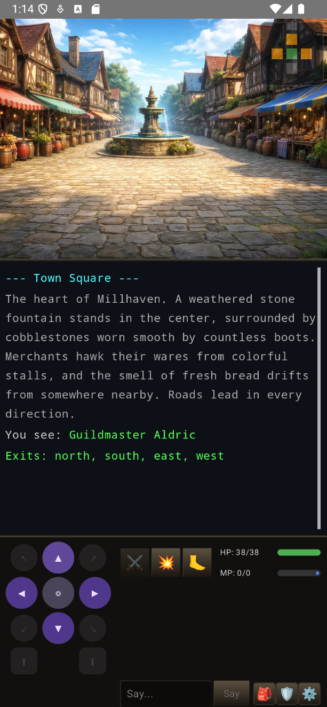
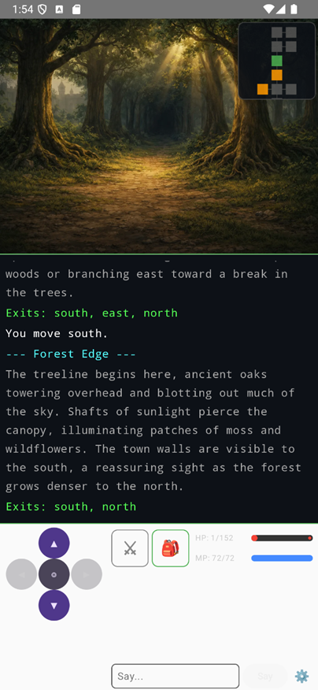
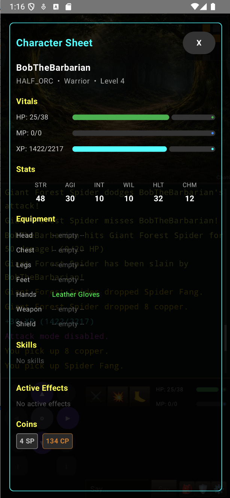

# NeoMud

A love letter to the MUDs of the '90s, built with modern tools and vibes. 100% vibe-coded with AI.

<p align="center">
  
  
  
</p>

## What Is This?

NeoMud is a multiplayer dungeon game inspired by the text-based MUDs (Multi-User Dungeons) that consumed countless hours on dial-up connections in the 1990s. Games like MajorMUD, Legends of Kesmai, and the countless DikuMUD derivatives that ran on BBSes and early internet servers — where imagination filled in what pixels couldn't.

This project is a tribute to that era, but it doesn't try to be a museum piece. It takes the core of what made MUDs great — exploration, combat, character progression, and shared worlds — and wraps it in a modern mobile client with room art, sprite overlays, and a real-time WebSocket backbone. The text log is still there. The direction pad is still there. But now you can *see* the tavern you're drinking in.

## Why Vibe Code a MUD?

Because MUDs were the original MMOs, and they got a lot of things right that modern games lost along the way:

- **Worlds driven by data, not code.** Rooms, items, NPCs, and loot tables are all JSON. A game master can reshape the world without recompiling anything.
- **Emergent multiplayer.** You share a room with other players. You see them arrive and leave. You talk. You fight the same monsters. No instancing, no sharding — just a shared world.
- **Mechanical transparency.** You know your stats. You know your weapon damage. You can reason about the systems, and that reasoning is the game.

This project is vibe-coded — built iteratively with AI assistance, following intuition over architecture docs, letting the design emerge from play. It's not production software. It's a playground.

## Architecture

```
NeoMud/
├── shared/     Kotlin Multiplatform — models and protocol shared between client and server
├── server/     Ktor + Netty — WebSocket game server with SQLite persistence
└── client/     Jetpack Compose — Android client with sprite rendering
```

**Server** runs a 1.5-second tick-based game loop. NPCs wander, patrol, and attack. Combat resolves each tick. Loot drops. The world turns.

**Client** connects over WebSocket and renders the game as a layered scene: room background, NPC and item sprites, floating minimap, game log, and controls.

**Shared** module contains the protocol (sealed classes with `kotlinx.serialization`) and all data models. Client and server speak the same language at compile time.

## Features

### The World
- Two zones: the town of Millhaven and the Whispering Forest
- 10 rooms with hand-crafted background art (AI-generated, background-removed, served as WebP)
- JSON-driven room definitions with coordinates, exits, and background images
- BFS-based minimap showing nearby rooms

### Characters
- 8 playable classes: Barbarian, Bard, Cleric, Druid, Fighter, Monk, Paladin, Ranger
- 5-stat system (STR/DEX/CON/INT/WIS) with class-specific base stats
- HP derived from Constitution, MP from Intelligence
- Equipment slots: weapon, shield, helmet, chest, hands, legs, feet

### Combat
- Tick-based (1.5s) — no button mashing, just tactical decisions
- Weapon damage = Strength + bonus + random roll; armor reduces incoming damage
- NPCs attack on sight if hostile
- Death respawns you at town square with a "YOU DIED" overlay (a nod to a certain other game)

### Items & Economy
- Data-driven items: weapons, armor, consumables, quest drops
- Loot tables per NPC with weighted drops
- Four-tier coin system: Copper, Silver, Gold, Platinum
- Ground loot rendered as clickable sprites

### Multiplayer
- Real-time WebSocket sessions
- Room-based chat
- See other players enter and leave
- One session per account
- Player state persisted on disconnect — log back in where you left off

## Tech Stack

| Layer | Technology |
|-------|-----------|
| Language | Kotlin 2.1 (JVM 21) |
| Server | Ktor 3.0 + Netty |
| Database | SQLite + Exposed ORM |
| Client | Jetpack Compose + Material 3 |
| Images | Coil 2.7 (WebP with transparency) |
| Protocol | kotlinx.serialization over WebSocket |
| Shared Code | Kotlin Multiplatform |
| Build | Gradle 8.11 with configuration cache |

## Running It

### Prerequisites
- JDK 21 (e.g., Amazon Corretto)
- Android SDK with platform 34
- Android emulator or device (min SDK 26)

### Server
```bash
export JAVA_HOME=/path/to/jdk21
./gradlew :server:run
```
The server starts on port 8080 with WebSocket at `/game` and health check at `/health`.

### Client
```bash
./gradlew :client:installDebug
```
Connect to `10.0.2.2:8080` from the emulator (or your server's IP from a device).

## Roadmap

This is an active project. Here's what exists, what's in progress, and where it's headed.

### What's Built
- [x] WebSocket multiplayer with real-time room presence
- [x] Two zones (town + forest) with 10 rooms
- [x] 8 character classes with stat-based differentiation
- [x] Tick-based combat with hostile NPCs
- [x] Basic inventory and equipment slots
- [x] Loot tables and ground item drops
- [x] Four-tier coin economy
- [x] Room background art and sprite overlays
- [x] Minimap, game log, character sheet
- [x] Death and respawn system
- [x] Player state persistence across sessions

### Up Next
- [ ] **Player Progression** — XP from combat, leveling, stat growth, scaling HP/MP per level
- [ ] **Skill System** — class-specific abilities (spells, combat arts, healing), cooldowns, mana costs
- [ ] **Vendor System** — NPC shops to buy/sell items and equipment, price balancing
- [ ] **Inventory Management** — item stacking, sorting, item comparison tooltips, bag capacity
- [ ] **Equipment Upgrades** — tiered gear, enchantments, item rarity system
- [ ] **Better Player Creation** — appearance options, starting gear per class, tutorial zone
- [ ] **NPC Dialogue** — conversation trees, quest givers, lore NPCs
- [ ] **Quest System** — kill quests, fetch quests, quest log, rewards

### Future Vision
- [ ] **More Zones** — dungeons, caves, swamps, castles — each with unique NPCs and loot
- [ ] **Crafting** — gather materials, combine into items, crafting recipes
- [ ] **Party System** — group up, shared XP, party chat, group combat tactics
- [ ] **PvP** — optional dueling, arenas, or PvP zones
- [ ] **Guilds/Clans** — player organizations, shared banks, guild halls
- [ ] **Boss Encounters** — multi-phase fights, special mechanics, rare drops
- [ ] **Status Effects Expansion** — poison, stun, bleed, buffs/debuffs with tactical depth
- [ ] **Emotes & Social** — /wave, /bow, roleplay support
- [ ] **World Events** — timed spawns, invasions, seasonal content
- [ ] **Admin/GM Tools** — in-game world editing, spawn commands, player management
- [ ] **iOS Client** — Compose Multiplatform or SwiftUI
- [ ] **Web Client** — browser-based alternative using the same WebSocket protocol

### NeoMUDMaker — The GM Toolkit
- [ ] **Visual Zone Builder** — drag-and-drop room editor with connection mapping
- [ ] **AI Art Pipeline** — generate room backgrounds, NPC sprites, and item icons from prompt templates using AI image generation — no artist required
- [ ] **NPC Designer** — create NPCs with stats, behaviors, dialogue trees, and loot tables in a visual editor
- [ ] **Item Forge** — design weapons, armor, and consumables with stat previews and auto-generated art
- [ ] **Quest Scripting** — visual quest builder with triggers, conditions, and branching outcomes
- [ ] **Live Preview** — test your world in-client without restarting the server
- [ ] **Publish & Share** — export zone packs for other NeoMud servers

### Someday/Maybe
- [ ] Procedural zone generation
- [ ] Player housing
- [ ] Economy simulation (supply/demand pricing)
- [ ] Achievement system
- [ ] Leaderboards
- [ ] LLM-powered NPC conversation

## The Spirit of the Thing

This isn't a finished game. It's a living sketch — a place to experiment with what a MUD looks like when you can see it, when the protocol is type-safe, when the world data lives in version control alongside the code.

If you played MUDs in the '90s, you'll recognize the bones. If you didn't, maybe this will show you what all the fuss was about.
