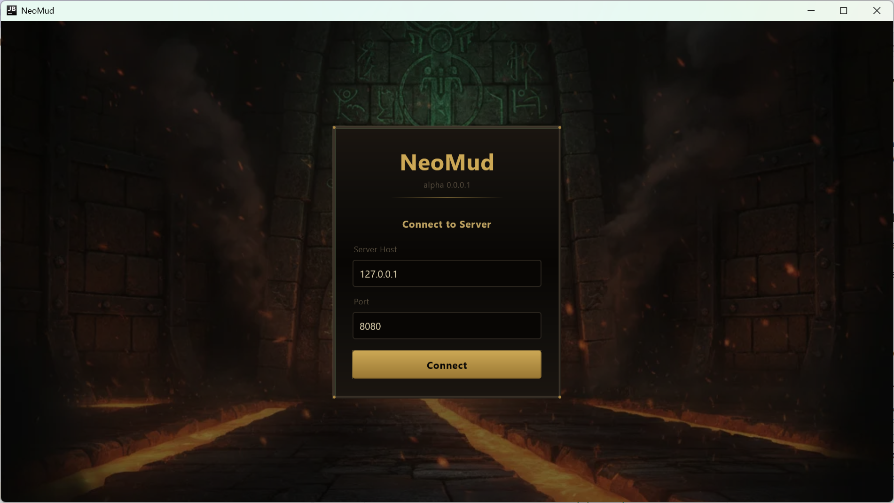
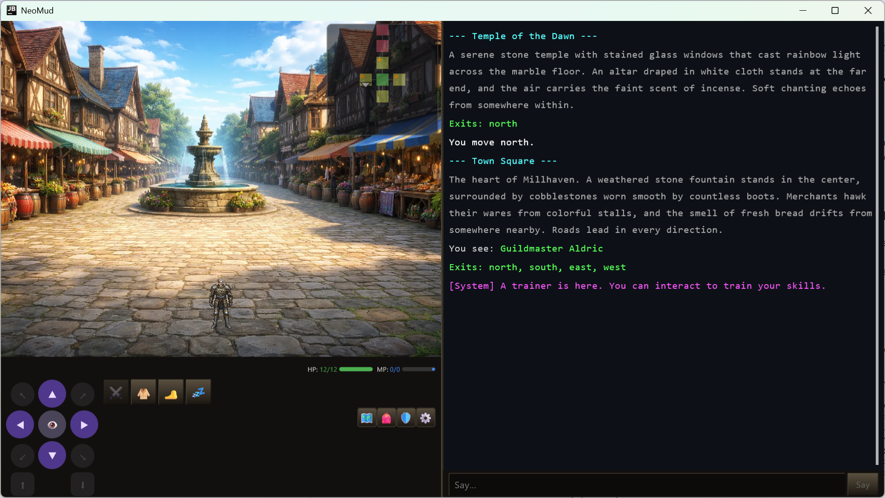
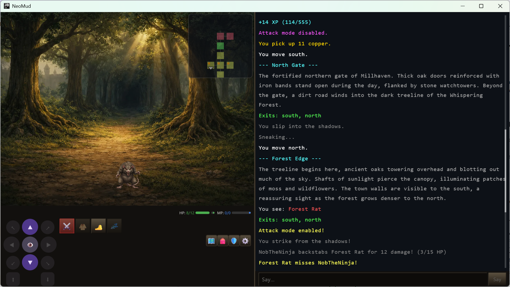
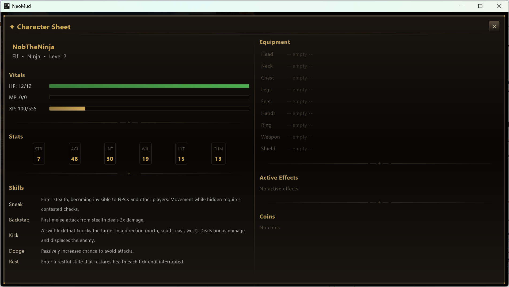

# NeoMud

A love letter to the MUDs of the '90s, built with modern tools and vibes. 100% vibe-coded with AI.

<p align="center">
  
  
</p>
<p align="center">
  
  
</p>
<p align="center">
  
  
</p>

## What Is This?

NeoMud is a multiplayer dungeon game inspired by the text-based MUDs (Multi-User Dungeons) that consumed countless hours on dial-up connections in the 1990s. Games like MajorMUD, Legends of Kesmai, and the countless DikuMUD derivatives that ran on BBSes and early internet servers — where imagination filled in what pixels couldn't.

This project is a tribute to that era, but it doesn't try to be a museum piece. It takes the core of what made MUDs great — exploration, combat, character progression, and shared worlds — and wraps it in a modern mobile client with room art, sprite overlays, and a real-time WebSocket backbone. The text log is still there. The direction pad is still there. But now you can *see* the tavern you're drinking in.

## Why Vibe Code a MUD?

Because MUDs were the original MMOs, and they got a lot of things right that modern games lost along the way:

- **Worlds driven by data, not code.** Rooms, items, NPCs, loot tables, spells, and skills are all JSON. A game master can reshape the world without recompiling anything.
- **Emergent multiplayer.** You share a room with other players. You see them arrive and leave. You talk. You fight the same monsters. No instancing, no sharding — just a shared world.
- **Mechanical transparency.** You know your stats. You know your weapon damage. You can reason about the systems, and that reasoning is the game.

This project is vibe-coded — built iteratively with AI assistance, following intuition over architecture docs, letting the design emerge from play. It's not production software. It's a playground.

## The World

The default world ships with **4 zones, 25 rooms, and 17 NPCs** across a progression from safe town to dangerous gorge:

| Zone | Level | Rooms | NPCs | Description |
|------|-------|-------|------|-------------|
| Millhaven | Safe | 7 | 5 | Starting town — vendors, trainers, temple, tavern |
| Whispering Forest | 1-3 | 7 | 4 | First combat zone — wolves, bandits, skeletons |
| Thornveil Marsh | 4-5 | 6 | 4 | Swamp zone — lizardfolk, bog horrors |
| Blackstone Gorge | 6-7 | 5 | 4 | End-game — gorge stalkers, cave trolls |

Every room has hand-prompted AI-generated background art. Every NPC and item has a sprite with proper alpha transparency. Every zone has background music and every action has sound effects — **460 assets** in total (357 images, 103 audio files).

## Features

### Characters
- **6 races** (Human, Dwarf, Elf, Halfling, Gnome, Half-Orc) with stat modifiers and XP scaling
- **15 classes** (Warrior, Paladin, Mage, Thief, Cleric, Druid, Ranger, Bard, and more) with unique skill/spell access
- 6-stat system with 60 CP allocation at creation and CP gains per level for ongoing training
- 9 equipment slots with paperdoll equip/unequip UI
- 270 unique player sprites (race/gender/class combinations)
- Starter equipment granted on character creation

### Combat
- **Tick-based** (1.5s) — all actions resolve in initiative order each tick
- Weapon damage = Strength + bonus + random roll; armor reduces incoming (min 1)
- **12 skills**: Bash (stun), Kick (knockback with direction picker), Backstab (from stealth), Parry, Dodge, Hide, Sneak, Meditate, Perception, Pick Lock, Track, Haggle
- **23 spells** across 5 schools (Mage, Priest, Druid, Kai, Bard) — damage, heal, buff, DoT, HoT
- Spell auto-cast — ready a spell once, it fires each tick until cancelled or out of MP
- Hostile NPC pursuit — engaged NPCs chase fleeing players
- Death respawns at temple with XP penalty

### NPCs & AI
- 5 behavior types: idle, wander, patrol, vendor, trainer
- Wander NPCs traverse connected rooms in their zone via random walks
- Patrol NPCs walk fixed routes (configurable in the maker with click-to-build route editor)
- Per-room and per-zone spawn caps with continuous respawn system
- Vendors with charm-based pricing and Haggle skill discounts
- Trainers for stat allocation and level-up

### Items & Economy
- 41 data-driven items: weapons, armor sets, consumables, scrolls, crafting materials
- 4-tier coin system: Copper, Silver, Gold, Platinum
- Loot tables per NPC type with weighted drop rates
- 3 town vendors: tavern (potions), blacksmith (weapons/armor), enchantress (scrolls/enchanted gear)
- Ground loot rendered as clickable sprites

### Client
- **Stone & Torchlight UI** — custom dark medieval forge aesthetic across all screens: stone-framed panels with beveled edges, corner rivets, runic inner glow, and torchlight-gold typography (no Material3 defaults)
- Login/registration splash screen with embedded forge background art and cinematic intro BGM
- Equipment paperdoll with tap-to-inspect flow (stats, description, unequip) instead of instant unequip
- Room scene: background art + NPC sprites + item sprites + player sprites
- BFS-based minimap with fog-of-war, zone color-coding, locked/hidden/interactable exit indicators
- 10-direction navigation (cardinal, diagonal, up/down)
- **Landscape mode** — side-by-side room art and game log with compact controls
- Spell bar with drag-to-assign slots and tap-to-ready auto-cast
- Icon grid inventory with item sprites and tap-to-use
- Per-zone background music with crossfade on zone transitions
- Sound effects for combat, spells, movement, and interactions
- Configurable volume controls for BGM and SFX

### Audio
- AI-generated sound effects via ElevenLabs — 104 audio files across combat, spells, items, NPCs, and ambient categories
- AI-composed background music via ElevenLabs — 5 BGM tracks including cinematic login theme
- Per-zone background music with crossfade transitions
- Embedded intro theme plays on login screen without server connection
- Per-NPC attack, miss, death, and interaction sounds
- Per-weapon attack and miss sounds
- Per-spell cast, impact, and miss sounds

## The Maker

The Maker is a full-featured web-based world editor for building and managing game content. It's a standalone React + Express application with its own Prisma/SQLite database that imports and exports `.nmd` world bundles.

### Editors
- **Zone Editor** — visual room placement on a shared global coordinate grid, click-to-connect exits, room properties (effects, hidden exits, interactables, spawn caps), and a **world map view** showing all zones simultaneously with per-zone coloring
- **NPC Editor** — 3-panel layout with NPC list, zone map visualization (BFS-based wander reachability, patrol route rendering, spawn point markers), and full property editing
- **Item Editor** — weapons, armor, consumables, scrolls with type-specific fields
- **Class Editor** — stat minimums, allowed skills/spells per class
- **Race Editor** — stat modifiers and XP scaling
- **Spell Editor** — damage, heal, buff, DoT/HoT with school and level requirements
- **Skill Editor** — active/passive skills with class restrictions and cooldowns
- **PC Sprite Editor** — manage 270 player sprites with race/gender/class filtering
- **Default SFX Editor** — assign and preview sounds across all entity types
- **Settings** — API keys for AI generation services

### Maker Features
- **Project system** — create, fork, open, and delete independent world projects
- **World map** — unified coordinate space across all zones; rooms can't overlap across zones
- **Import/export** — `.nmd` bundles (ZIP archives with JSON data + image/audio assets)
- **Validation** — server-side HTML rejection, name length limits, text sanitization on all entity routes
- **AI generation pipeline** — image generation (Nano Banana), background removal (rembg), sound effect generation (ElevenLabs) integrated into the editor workflow

## Architecture

```
NeoMud/
├── shared/     Kotlin Multiplatform — models and protocol shared between client and server
├── server/     Ktor 3.x + Netty — WebSocket game server with SQLite persistence
├── client/     Compose Multiplatform — game client (Android + Desktop)
├── maker/      React 18 + Express — web-based world editor and GM toolkit
├── scripts/    Utility scripts (background removal, game relay, etc.)
└── .claude/    AI agents, skills, and memory for Claude Code tooling
```

**Server** runs a 1.5-second tick-based game loop. Combat actions queue on the player session and resolve each tick in initiative order: bash, kick, readied spell, then melee. NPC behaviors (wander, patrol, pursuit, attack) execute after combat. All NPC kills flow through a single handler for loot, XP, and state cleanup. The world is loaded from a `.nmd` bundle at startup — a self-contained ZIP archive, similar to DOOM's WAD files.

**Client** is a Compose Multiplatform application — 89% of the code (UI components, screens, viewmodels, networking) lives in a shared `commonMain` source set, with only platform-specific glue (entry point, audio, logging) in `androidMain` and `desktopMain`. Runs on Android and Desktop (JVM) today, with iOS and Web planned. The client connects over WebSocket and renders the game as a layered scene. The protocol is type-safe sealed classes with `kotlinx.serialization` — client and server share the same Kotlin types at compile time via the shared module.

**Maker** is a separate web application for world authoring. It has its own database, its own API, and exports `.nmd` bundles that the server consumes. The zone editor renders all zones on a single shared coordinate grid, enforcing global spatial consistency.

## Tech Stack

| Layer | Technology |
|-------|-----------|
| Language | Kotlin 2.3 (JVM 21) |
| Server | Ktor 3.4 + Netty |
| Database | SQLite + Exposed ORM |
| Client | Compose Multiplatform (Android + Desktop, iOS/Web planned) |
| Images | Coil 3 (WebP with transparency, multiplatform) |
| Audio | Android MediaPlayer + SoundPool; Desktop JavaFX Media (via expect/actual `PlatformAudioManager`) |
| Protocol | kotlinx.serialization over WebSocket |
| Navigation | JetBrains Navigation Compose (multiplatform) |
| Lifecycle | JetBrains Lifecycle ViewModel (multiplatform) |
| Shared Code | Kotlin Multiplatform |
| Build | Gradle 9.2 with configuration cache |
| Maker | React 18 + Express + Prisma + SQLite |

## By the Numbers

| Metric | Count |
|--------|-------|
| Lines of code | ~45,500 (30.5k Kotlin, 15k TypeScript) |
| Commits | 246 |
| Tests | 830 (386 server, 151 shared, 293 maker) |
| Assets | 462 (357 images, 105 audio) |
| Player sprites | 270 (6 races x 3 genders x 15 classes) |
| World content | 4 zones, 25 rooms, 17 NPCs, 41 items, 23 spells, 12 skills, 15 classes, 6 races |

## Running It

### Prerequisites
- JDK 21 (e.g., Amazon Corretto)
- Android SDK with platform 34+
- Android emulator or device (min SDK 26)
- Node.js 18+ (for the Maker)

### macOS Setup

```bash
# Install JDK 21 via Homebrew
brew install --cask corretto@21
export JAVA_HOME=$(/usr/libexec/java_home -v 21)

# Install Android SDK via Homebrew (or use Android Studio)
brew install --cask android-commandlinetools
sdkmanager "platforms;android-34" "build-tools;34.0.0"
export ANDROID_HOME=$HOME/Library/Android/sdk

# Add to your shell profile (~/.zshrc or ~/.bash_profile) to persist:
echo 'export JAVA_HOME=$(/usr/libexec/java_home -v 21)' >> ~/.zshrc
echo 'export ANDROID_HOME=$HOME/Library/Android/sdk' >> ~/.zshrc

# Install Node.js (for the Maker)
brew install node@18

# After cloning, generate the Prisma client before running the Maker:
cd maker && npm install   # postinstall runs prisma generate automatically
```

### Server
```bash
export JAVA_HOME=/path/to/jdk21
./gradlew packageWorld --rerun-tasks   # Build the .nmd world bundle
./gradlew :server:run                  # Starts on :8080, WebSocket at /game
```

### Client (Android)
```bash
./gradlew :client:installDebug
```
Connect to `10.0.2.2:8080` from the emulator (or your server's IP from a device).

### Client (Desktop)
```bash
./gradlew :client:run
```
Launches a desktop window — defaults to `127.0.0.1:8080`.

### Maker
```bash
cd maker
npm install
npm run dev
```
Opens the world editor at `http://localhost:5173`. On first run, it auto-imports the default world.

### Tests
```bash
export JAVA_HOME=/path/to/jdk21
./gradlew :shared:jvmTest :server:test   # Server + shared tests (537 tests)
cd maker && npx vitest run               # Maker tests (293 tests)
```

## AI Tooling

This project is built entirely with [Claude Code](https://claude.com/claude-code), using custom agents and skills in the `.claude/` directory:

| Skill | Purpose |
|-------|---------|
| `/game-designer` | RPG balance analysis — models combat math, audits data files, proposes tuning changes |
| `/playtest` | AI playtester — plays the game via WebSocket relay, files GitHub issues for bugs |
| `/worldmaker` | Browser-based QA agent — tests the Maker UI through Playwright interaction |
| `/bugfixer` | Automated issue triage — works through the GitHub backlog |
| `/elevenlabs-sfx` | Sound effect and BGM generation via ElevenLabs AI |
| `/rebuild-world` | Rebuilds the `.nmd` bundle after asset changes |

Agent memory in `.claude/agent-memory/` persists findings across sessions — the game designer remembers its balance audits, the worldmaker remembers UI patterns it's tested, and the playtester remembers what it's explored.

## Roadmap

### Near Term
- [ ] Game balance pass — melee vs. magic disparity, class viability, difficulty curve smoothing
- [ ] Fill dead-end rooms with content (Forest Cave, Marsh Island, Gorge Alcove)
- [ ] BGM seamless looping
- [x] Replace raw JSON fields in maker editors with structured UI controls

### Medium Term
- [ ] Quest system — kill quests, fetch quests, quest log, NPC dialogue trees
- [ ] Crafting system — use the crafting materials that currently drop with no purpose
- [ ] Boss encounters with special mechanics
- [ ] Multiplayer stress testing — concurrent combat, reconnection, edge cases

### Multiplatform Clients
- [x] Desktop (JVM) client — JavaFX audio, Ktor CIO networking, full feature parity ([#140](https://github.com/terrymaster/NeoMud/issues/140))
- [ ] iOS client — Kotlin/Native + AVFoundation audio ([#141](https://github.com/terrymaster/NeoMud/issues/141))
- [ ] Web (Wasm) client — zero-install browser play ([#142](https://github.com/terrymaster/NeoMud/issues/142))

### Future Vision
- [ ] Party system with shared XP and group combat
- [ ] PvP — dueling, arenas, or PvP zones
- [ ] World events — timed spawns, invasions
- [ ] Player guilds and social features

## The Spirit of the Thing

This isn't a finished game. It's a living sketch — a place to experiment with what a MUD looks like when you can see it, when the protocol is type-safe, when the world data lives in version control alongside the code, and when an AI can playtest its own creation.

If you played MUDs in the '90s, you'll recognize the bones. If you didn't, maybe this will show you what all the fuss was about.
